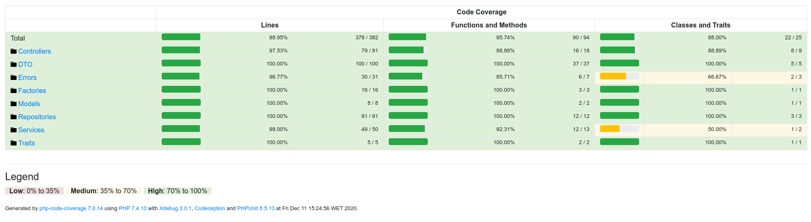

# IxDF API

IxDF API: Simples API using Phalcon Framework

## Motivation

Since I cannot use or reveal proprietary company code, I decided to create a simple API from scratch to demonstrate my way of programming and applying OOP concepts and best practices. As well as DevOps concepts and tests.

### User History

This project is based in this user history:

```
AS an User
I WANT TO access an API to get students and courses and creates them too.

Notes:
- The API must follow REST
- Must provide tests and coverage
- Must provide an automated pipeline
- Must follow the Testing Guidelines and Code Style Guidelines
- Must Use a Cache System to reduce costs with cloud servers
```

Test Guidelines: you can read [here](Tests-Guideline.pdf)
 
Code Style: you can read [here](CodingSytle-PHP.pdf)

## How To Use

### Start Environment

To use the system, simple Type `make up` to start the container
and `make down` to stop it.

```bash
make up
make down
```

### Accessing API

After start the conteiner, you can access the API, using any http client,
connect in this address `http://localhost:8080/students/`. For example using CURL:

```
curl http://localhost:8080/students/
```

If something wrong occurs, see the Setup Section below, to ensure that all initial steps were made.

To know all endpoint, see OAS bellow.

### Open API Specification

This api use OAS and it spec can be visualized in the openapi.json [here](https://gitlab.com/jmsilvadev/ixdf-api/-/blob/master/openapi.json) file and and through the endpoint `/oas`.


## Development

### Semantic Versioning

The API uses the automatic versioning system, which facilitates version control by minimizing breaks, providing faster and more effective regression resources and increasing the power of deploys. Every time a merge request is accepted, the pipeline will generate a TAG and store it in the repository. The tags can be viewed [here](https://gitlab.com/jmsilvadev/ixdf/-/tags).


### Cache System

The API uses the self-managing dynamic cache system using Redis. Every time a GET request arrives at the API it checks if there is already a cache for the call and if so, it returns the cache value, if not, it passes the request to the API and at the end of the cycle caches the response. When the API receives action verbs like POST / PUT, the cache system automatically invalidates only the affected endpoints. In this way, the API has a fully automated cache management, significantly reducing the traffic and use of the computational resources of the servers.


### DevOps

The API was conceived within the devops culture using continuous integration and continuous delivery through automated pipelines. The entire environment is containerized and easily manipulated through a Makefile file.
Pipelines can be viewed [here](https://gitlab.com/jmsilvadev/ixdf/-/pipelines).


### Setup project

To set up an API container you should download the source code from
git and install it.

The `make install` should be only used once. It will install all the
dependences and insert the fake data to the database.
After this, you should only use the `make up` & `make down` to controll your
container.

You are now ready to use the system. Type `make up` to start the container
and `make down` to stop it.

### Build tools

Build the image

```bash
make build
```

### Composer

To install / update or add composer dependencies:

```bash
make composer.install
make composer.update
```

### Code Quality

PHP Metrics:

```bash
make php.metrics
```

PHP CS:

```bash
make php.cs
```

PHP CBF:

```bash
make php.cbf
```

PHP MD:

```bash
make php.md
```

### Tests

Last Coverage: 


Run all tests suite

```bash
make test
```

Run specifit test suits

```bash
make test.unit ## unit tests suite
make test.coverage ## coverage
```

### Migrations (DB)

To create DB Structure (Migrations):

```bash
make createdb
```


```bash
make db.migrate
```

### MakeFile

To make our tools abstract to the intentions we use simple make commands to
perform tasks like: launch a test suite.
Example:.

```bash
make test
```

To learn all the commands the MakeFile can do just use the command
`make` or `make help`


# About the Email 

## 1. As a first point, could you please send us a code sample of some production code you have written and which you are proud of – or find interesting in some way? Please also write *why* you are either proud of that code or why you find it interesting. I assume you’re under an NDA for most of your code so it does not have to be executable code but just some snippets. Please send us something “non-generic” – even if we can’t understand the context and greater purpose of the code. 

Language requirements: JavaScript, TypeScript or PHP
How to send them to us: source files or github/gist/bitbucket/gitlab. If you would like to share a private repository, please give read access for the following user: “ixdf-bot”. This works with github and bitbucket: https://github.com/ixdf-bot and https://bitbucket.org/ixdf-bot/  

Since I cannot use or reveal proprietary company code, I decided to create a simple API from scratch to demonstrate my way of programming and applying OOP concepts and best practices. As well as DevOps concepts and tests.


## 2. How do you decide when the test coverage of a given feature is good enough? How do you decide what should be tested and what sort of tests should be used?

For me, code coverage should be at least 95% with a CRAP index as low as possible. For me, it is not feasible to have a low code coverage since the use of TDD forces you to do your tests even before the code. :) That is, at the end of the development cycle your coverage must be at least 70%, that is why we know that the first tests are done so that the functionality passes, but then there must be validation tests that will increase this percentage. My coverage is generally above 95% in production systems, and the remaining 5% are pieces of code that do not have an advantageous cost / benefit ratio, that is, it would be very complex to develop a code to cover a line that would be, for example , a throw. Attached is the test guideline that I always try to apply to the companies I go to and that was adopted by my current company after an awareness work I did with the team.

## 3. How do you reduce code coupling? Can you give an example of when you last encountered and fixed a coupled code issue?

In a simple and quick answer, decouple :D But to make an efficient decoupling it is necessary to know the concepts of Afferent Coupling (CA), Efferent Coupling (CE), Instability and above all S.O.L.I.D. The coupling occurs when a class depends on another class, in other words, it knows too much about the other class and this is very bad, because it leads to a concept called esparghetti code (I love esparghetti, but I hate code smell ;) ). So it is said that a class is strongly coupled when a change from another class breaks or behaves from this class (CE) or a change from this class breaks the behavior of another class (CA). In an object-oriented system the CA and the CE must always exist, however to maintain a stable system we must always be aware of the level of instability of the classes. A class always has to be more unstable than the class it depends on, but that's not all. In order to end a class's knowledge of other classes and decouple it, we know the principles of SOLID. What do we really need to do to have a decoupled system? Apply SOLID :D. First of all, a class must have a single purpose, it cannot do much, that is, if a class is only used to retrieve data from the user table, for example, it should only know how to do it therefore, it must not know how to make validations, calculations, or data persistence, that is, it must have a single responsibility, and this is the first principle of SOLID, SRP (Single Responsibility). In addition, a class should always depend on its abstractions, this will cause the eference to be reduced drastically, and to make a class depend on an abstraction, use the design pattern Depency Injection;), which does lead us to the D of SOLID (Dependency inversion principle). But, still, it is necessary to provide that a class uses an abstraction from another class and to guarantee thiswe can use the interface segmentation principle, that is, when applying interfaces to our classes, we can easily inject these interfaces into other classes instead of inserting concrete classes, amazing!, and do you know what the gain is? Stability, which leads us to another very important principle of SOLID, which is the principle of Open/Closed, a class must be open for access and closed for changes, now if a class has a high CA, any change in that class can compromise the stability of the system, so this class has to be protected for changes, and the best way to do that is using interfaces or abstract classes, we should only be careful of the correct use of abstract classes because its misuse can break the other principle of SOLID called the Liskov principle. ;)

In short, after so much talk, what is needed to reduce coupling, in simple words and briefly: classes must depend on their abstractions using the principle of inversion of dependency and have well-defined specific responsibilities.

Can you give an example of when you last encountered and fixed a coupled code issue?

Sure!

Before: In this way it is not possible to carry out tests or use mocks.
```
public function getArticleImages($articlesResult, array $imageSuffix, ?string $idField = null)
{
 $idField = $idField ?? 'content_id';
 $idArticles = [];
 foreach ($articlesResult->data as $article) {
 if (!empty($article->content_id)) {
 $idArticles[] = $article->content_id;
 $idField = 'content_id';
 }
 if (!empty($article->article_id)) {
 $idArticles[] = $article->article_id;
 $idField = 'article_id';
 }
 if (!empty($article->id)) {
 $idArticles[] = $article->id;
 $idField = 'id';
 }
 }

 $images = (new BaseImagesRepository($this->images))->getContentImagesByContentId(
 $idArticles,
 $imageSuffix
 );

 $options = [];
 $options['idField'] = $idField;
 $options['imageSuffix'] = $imageSuffix;

 return (new ImageHelper())->injectImages((array) $articlesResult->data, (array) $images->data, $options);
}
```

After: We can inject mocks to test this code now :D
```
<?php


namespace _7Graus\Contents\Repositories;

use _7Graus\Contents\Helpers\Interfaces\ImageHelperInterface;
use _7Graus\Contents\Repositories\Interfaces\BaseImagesRepositoryInterface;


class ArticleImageService
{
 public BaseImagesRepositoryInterface $imageRepository;
 public ImageHelperInterface $imageHelper;

 public function __construct(
 BaseImagesRepositoryInterface $imageRepository,
 ImageHelperInterface $imageHelper)
 {
 $this->imageRepository = $imageRepository;
 $this->imageHelper = $imageHelper;
 }

 private function getArticleImages($articlesResult, array $imageSuffix, ?string $idField = null)
 {
 $idField = $idField ?? 'content_id';
 $idArticles = [];
 foreach ($articlesResult->data as $article) {
 if (!empty($article->content_id)) {
 $idArticles[] = $article->content_id;
 $idField = 'content_id';
 }
 if (!empty($article->article_id)) {
 $idArticles[] = $article->article_id;
 $idField = 'article_id';
 }
 if (!empty($article->id)) {
 $idArticles[] = $article->id;
 $idField = 'id';
 }
 }

 $images = $this->imageRepostory->getContentImagesByContentId(
 $idArticles,
 $imageSuffix
 );

 $options = [];
 $options['idField'] = $idField;
 $options['imageSuffix'] = $imageSuffix;

 return $this->imageHelper->injectImages((array) $articlesResult->data, (array) $images->data, $options);
 }
}
```
## 4. Do you have a continuous learning plan? What resources do you use to acquire new knowledge and skills?

I don't have a well-defined continuous learning plan, to be honest. What I do is to see which languages are high in the community and I set learning goals, for example, now I am improving myself in Golang and Typescript. However, I am always looking to learn new things so that my brain is always in moviment, but I don't have a defined plan. As I said, what I do every day is to follow the news on the Medium website and define new languages and techniques to learn. I subscribe to Symfonycasts and Pluralsight too.

## 5. What is most important to you when you look for a new job?

The most important thing is undoubtedly having contact with new challenges that make me evolve as a professional and that can somehow impact the world. I simply need to be constantly evolving, when I feel that I am stationed I look for a change. So I'm looking for a company that challenges me to make me grow. In addition, an environment with a horizontal hierarchy that promotes well-being and encourages trust among the team, is always good :)

## 6. What challenges do you expect to encounter when working remotely? (If you are an experienced remote worker, please describe problems you have already solved and how have you solved them)

I've been working remotely for a year, since the pandemic began. Honestly I have adapted very well to this model of work and I say that I am being more efficient that way. For me, the negative point was the distance with the co-workers, but I believe that if the company do  frequent enconters with the team this resolves the problem and helps to increase the ties between the team. Another thing that I had difficulty in the beginning was the organization of time and isolation at home. At the beginning, my family still interrupted me during working hours, but I resolved this by establishing well-defined rules with them. As I mentioned in the first email, I have an office inside my house, where my family knows that when I'm there with the door closed, they can't even knock on the door, if they need to talk to me, they make a call. The door is only opened by them in emergency / urgent cases. Why? Because when I'm making code I get immersed in the task and don't waste several minutes to get back to the same concentration that immersion requires.

## 7. How do you – in loose terms – define the act of “taking ownership over your work”? Can you give a concrete example of a recent situation when you took ownership of your work?

In my company, the culture of ownership and accountability is encouraged, so we are encouraged to assume our responsibility and also to speak to other team members when something is going wrong or well. For that we use the feedback culture. For me, taking responsibility is not just about a single member but about the team, if we manage to have a relationship based on confinement, where everyone has a voice and decisions are made by the group, the burden of responsibility is much less. Of course, sharing responsibility does not mean that no one has responsibility, on the contrary, when we have a trusting relationship with our colleague, we feel more comfortable asking for help and assuming our failures. A concrete example of a recent situation that happened to me was last week. I have the role of managing a team of seven developers and every fifteen days a committee meeting is held where I have to present the status of the projects. This last week, there was a smaller delivery, which was under my responsibility. I had received a status report from a member of the team responsible for that, stating that it would not yet be delivered due to an external dependency, which I was tasked with resolving. Well, I forgot to resolve the external dependency and at the committee meeting it was seen that the product was not delivered due to a simple question from a supplier. Immediately in front of the company's CEOs I took responsibility and said that it was my fault and that I did not deal with the matter with the importance it deserved. I apologized and I will be more attentive. Lesson learned.

## 8. Could you please do an audit of our home page at https://www.interaction-design.org/ where you focus on – for example – performance, accessibility, UX, SEO, “best practice issues” or whatever you feel is appropriate? Please provide your recommendations on how to improve the points you find during your audit. Please focus on areas that you know very well (for example if you don’t know SEO, then simply omit it). Note that we appreciate analysis based on your experience as opposed to the output of an audit tool.
I don't have a lot of knowledge with SEO, this is one of the points that I really need to improve. Currently I receive guidelines from the company where we have to check some aspects on the website, such as metadata, the use of google pagespeed and the lighthouse. In addition, we always have an AMP version of our sites and use tools like screaming frog to find flaws. So, unfortunately, I don't feel comfortable auditing your pages, after all, this is not my area of expertise. Sorry. :(

## 9. And finally, how did you hear about this open position? 

As I said earlier, I adapted very well to remote work and decided to look for a company where I can work remotely, because my current company does not allow this possibility, after the end of the pandemic, we must go back to the office and my desire is to continue with the remote work . In this way, I looked at Linkedin for a company that offered vacancies for remote work and found the opportunity of IxDF. I researched the company and was amazed, so I decided to take a chance. :)
